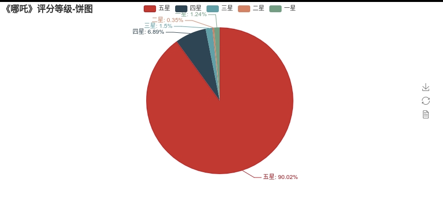
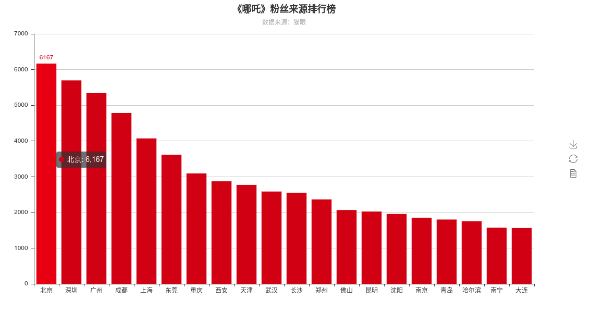

# movie_comments_analysis
电影《哪吒》评论分析

在爬虫过程中，从索引0位置开始爬取数据，被服务器限制爬取评论索引条目为1000，通过观察jason文件链接，发现链接中包含日期时间数据。通过改变startTime的值来获取更多的评论信息，将offset设置为0，把每页评论数据中最后一次评论时间作为新的startTime去请求，破解了服务器的爬虫限制。获取了20w条评论数据.

使用pyecharts库，试图将评论者的地理位置分布以及该地区电影热度可视化。此过程中爬取的城市名与pyecharts中默认配置的标准地名不一致。通过python处理了城市名称简写/城市行政变更的问题，最终生成了用户地理位置及该地区电影热度的可视化结果。使用jieba，对评论内容进行分词，使用matplotlib和wordcloud绘制词云图*

> 电影哪吒用户位置分布及热度

> 云词图

> 评分等级-饼图

> 粉丝来源-柱状图

